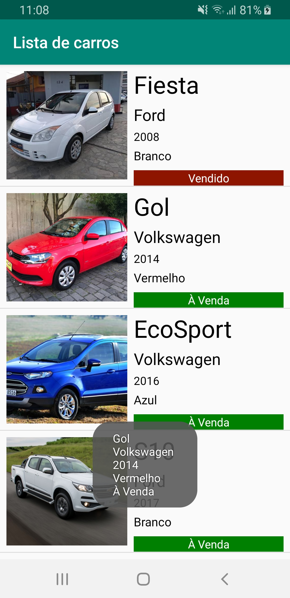
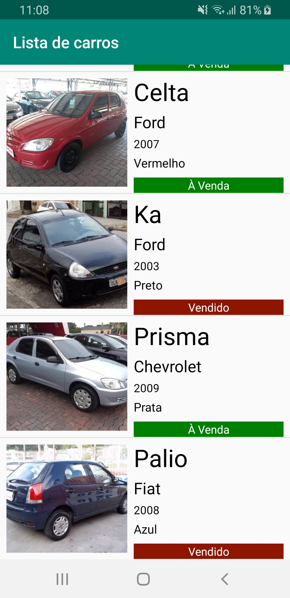
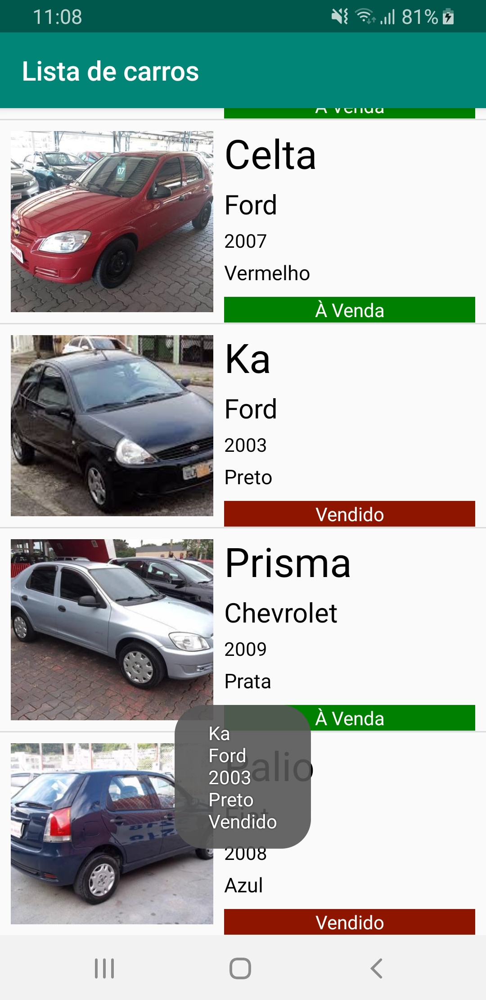

# Exemplo lista personalizada (Java)
Criação de uma lista personalizada adicionando imagens e texto. O exemplo apresenta os seguintes itens:

* Organização dos pacotes da aplicação
* Utilização de <b>enum</b>
* Utilização do <b>BaseAdapter</b> para criação da lista
* Uso do <b>LinearLayout</b> na criação do layout da lista
* Capturar o item correto da lista ao tocar na tela

Obs.: Para grandes listas é recomendado a utilização do <b>RecyclerView</b> no lugar do <b>ListView</b>. O <b>RecyclerView</b> faz o cache do <b>findViewById</b>, não sendo necessário acionar o método <b>findViewById</b> inúmeras vezes toda vez que o usuário rolar pela lista, como resultado é exibida uma lista muito mais fluída, pois as células são recicladas.

        

### Licença
Este repositório está disponível sob a licença [Mozilla Public License, version 2.0](https://github.com/jhonatasrm/exemplo-lista-personalizada/blob/master/LICENSE)
